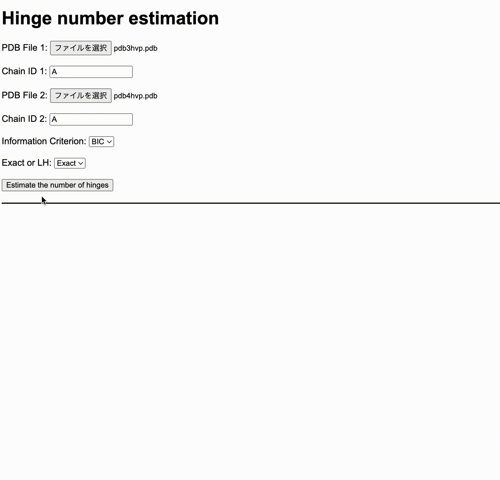

# BIC Exact and BIC LH
- Fast and accurate algorithms for estimating the number of hinges in a protein based on information criteria.
- $O(n^2)$-time exact algorithm, where $n$ is the protein length
- $O(n)$-time heuristic algorithm, where $n$ is the protein length
## Input and Output
- Input: two conformations of the same protein
- Output: the number of hinges and the corresponding hinge positions
## Methods
- For details on the methods, please refer to our upcoming paper.

## Experiments
- build the docker container
```bash
docker-compose up -d
```
- If you want to work inside the docker container, execute the following command
```bash
docker exec -it bel bash
```
### Install libraries for Python
- inside the docker container
```bash
poetry install
```
  - outside the docker container
```bash
docker exec bel poetry install
```
### Constructing a simulation dataset
- Please make sure you downloaded all pdb files in the all_pdb directory before you execute the following command
- inside the docker container
```bash
poetry run python make_simulation_dataset.py
```
- outside the docker container
```bash
docker exec bel poetry run python make_simulation_dataset.py
```
### Experiments on the simulation dataset
- inside the docker container
```bash
bash simulation_bic.sh
```
- outside the docker container
```bash
docker exec bel bash simulation_bic.sh
```
### Experiments on the Shibuya 2008 dataset
- inside the docker container
```bash
bash speed_comparison_rmsdh.sh
```
- outside the docker container
```bash
docker exec bel bash speed_comparison_rmsdh.sh
```
### Evaluating the results on the simulation dataset
- inside the docker container
```bash
poetry run python plot_accuracy_f_measure.py
```
- outside the docker container
```bash
docker exec bel poetry run python plot_accuracy_f_measure.py
```
### Evaluating the results on the Shibuya 2008 dataset
- inside the docker container
```bash
poetry run python eval_result_shibuya.py
```
- outside the docker container
```bash
docker exec bel poetry run python eval_result_shibuya.py
```

## Example usage
### CUI
#### When you execute the command outside the docker container
```bash
docker exec bel g++ estimate_hinge_numbers.cpp -o estimate_hinge_numbers -std=c++14 -lstdc++fs -Wall -Wextra -O3 -mtune=native -march=native -mfpmath=both -Werror -fopenmp
docker exec bel ./estimate_hinge_numbers pdb3hvp.pdb pdb4hvp.pdb A A bic exact
docker exec bel ./estimate_hinge_numbers pdb3hvp.pdb pdb4hvp.pdb A A bic lh
```
#### When you execute the command inside the docker container
```bash
g++ estimate_hinge_numbers.cpp -o estimate_hinge_numbers -std=c++14 -lstdc++fs -Wall -Wextra -O3 -mtune=native -march=native -mfpmath=both -Werror -fopenmp
./estimate_hinge_numbers pdb3hvp.pdb pdb4hvp.pdb A A bic exact
./estimate_hinge_numbers pdb3hvp.pdb pdb4hvp.pdb A A bic lh
```
### GUI
- After you build the estimate_hinge_numbers.cpp, start the web server on your local computer
```bash
cd src
go mod download
go run main.go
```
- access the following link: http://localhost:8080/


